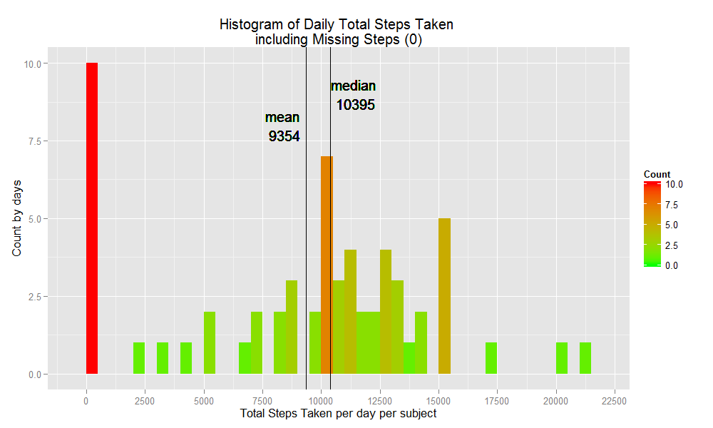
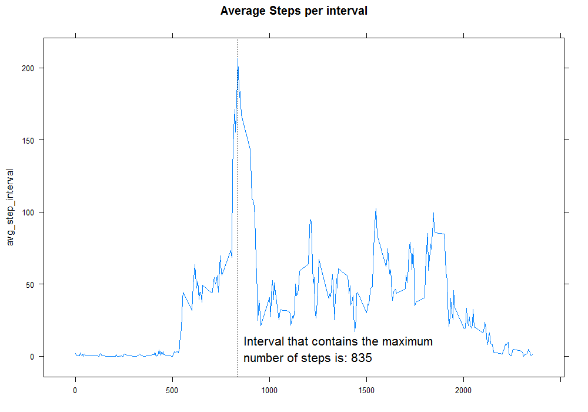

# Loading and preprocessing the data

## Set up `knitr`

```r
# setting knitr optionsn to better display chars
library(knitr)
options(width = 100)
opts_chunk$set(message = F, error = F, warning = F, comment = NA, fig.align = 'center', dpi = 100, tidy = F, cache.path = '.cache/', fig.path = 'fig/')

options(xtable.type = 'html')
knit_hooks$set(inline = function(x) {
  if(is.numeric(x)) {
    round(x, getOption('digits'))
  } else {
    paste(as.character(x), collapse = ', ')
  }
})
knit_hooks$set(plot = knitr:::hook_plot_html)
```


## Loading data

```r
ifelse(!file.exists("data"),dir.create("data"),"dir exists")
```

```
[1] "dir exists"
```

```r
file<-"http://d396qusza40orc.cloudfront.net/repdata%2Fdata%2Factivity.zip"
ifelse(!file.exists("./data/activity.zip"),
       download.file(file,"./data/activity.zip",mode='wb'),
       "Skip! File downloaded")
```

```
[1] "Skip! File downloaded"
```

```r

unzip<-unzip("./data/activity.zip")
act <- read.csv(unzip)
library(data.table)
dt<-data.table(act)
sum<-dt[,sum(steps,na.rm=T),by=date]
setnames(sum,"V1","total_steps")
head(act)
```

```
  steps       date interval
1    NA 2012-10-01        0
2    NA 2012-10-01        5
3    NA 2012-10-01       10
4    NA 2012-10-01       15
5    NA 2012-10-01       20
6    NA 2012-10-01       25
```


# What is mean total number of steps taken per day?
===================================================

## Make a histogram of the total number of steps taken each day


```r
## Histogram using ggplot2
mean<-mean(sum$total_steps)
med<-median(sum$total_steps)
library(ggplot2)
      m <- ggplot(sum, aes(x=total_steps))
      m + 
        geom_histogram(aes(fill = ..count..),binwidth = 500) +
        labs(title="Histogram of Daily Total Steps Taken \nincluding Missing Steps (0)",cex=2) +
        labs(x="Total Steps Taken per day per subject",ces=1.2) +
        scale_fill_gradient("Count", low = "green", high = "red") +
        scale_y_continuous("Count by days") +
        scale_x_continuous(breaks=c(seq(0,22500, by=2500))) +
        geom_vline(xintercept=c(mean,med),show.guide=T)+
        geom_text(data=NULL,x=mean-1000,y=8,label=paste("mean\n",round(mean,0)))+
        geom_text(data=NULL,x=med+1000,y=9,label=paste("median\n",med))
```

<div class="rimage center"></div>


## Calculate and report the mean and median total number of steps taken per day


```r
print(paste("Mean of total number of steps taken per day is:",round(mean,1)))
```

```
[1] "Mean of total number of steps taken per day is: 9354.2"
```

```r
print(paste("Median of total number of steps taken per day is:",round(med,1)))
```

```
[1] "Median of total number of steps taken per day is: 10395"
```


  
  
# What is the average daily activity pattern?

## 1.Make a time series plot (i.e. type = "l") of the 5-minute interval (x-axis) and the average number of steps taken, averaged across all days (y-axis)


```r
    library(data.table)
    dt<-data.table(act)
    avg_data<-dt[,mean(steps,na.rm=TRUE),by=interval]
    setnames(avg_data,"V1","avg_step_interval")
    library(lattice)
    xyplot(avg_step_interval ~ interval,data=avg_data,type='l',lty=1,main="Average Steps per interval",xlab="")
```

<div class="rimage center"></div>


## 2. Which 5-minute interval, on average across all the days in the dataset, contains the maximum number of steps?


```r
max_step_interval<-data.frame(avg_data[which(avg_data$avg_step_interval==max(avg_data$avg_step_interval)),])[,1]
print(paste("Intrval that contains the maximum number of steps is:",max_step_interval))
```

```
[1] "Intrval that contains the maximum number of steps is: 835"
```


# Imputing missing values


```r
sum(is.na(act$steps)) #sum(!complete.cases(act))
```

```
[1] 2304
```

```r
print(paste("Total # of rows with missing data is BEFORE impute:",sum(!complete.cases(act))))
```

```
[1] "Total # of rows with missing data is BEFORE impute: 2304"
```

```r

library(data.table)
dt<-NA;dt<-data.table(act)
dt[,median:=median(steps,na.rm=TRUE),by=interval] # calculate median of steps by interval
```

```
       steps       date interval median
    1:    NA 2012-10-01        0      0
    2:    NA 2012-10-01        5      0
    3:    NA 2012-10-01       10      0
    4:    NA 2012-10-01       15      0
    5:    NA 2012-10-01       20      0
   ---                                 
17564:    NA 2012-11-30     2335      0
17565:    NA 2012-11-30     2340      0
17566:    NA 2012-11-30     2345      0
17567:    NA 2012-11-30     2350      0
17568:    NA 2012-11-30     2355      0
```

```r
dt<-data.frame(dt)
dt[is.na(dt$steps),1:1]<-dt[is.na(dt$steps),"median"] # impute missing steps with median steps per interval

print(paste("Total # of rows with missing datais AFTER impute:",sum(!complete.cases(dt))))
```

```
[1] "Total # of rows with missing datais AFTER impute: 0"
```


```r
library(data.table)
##re-generate table for chartting. 
dt<-NA;dt<-data.table(act)
dt[,median:=median(steps,na.rm=TRUE),by=interval]
```

```
       steps       date interval median
    1:    NA 2012-10-01        0      0
    2:    NA 2012-10-01        5      0
    3:    NA 2012-10-01       10      0
    4:    NA 2012-10-01       15      0
    5:    NA 2012-10-01       20      0
   ---                                 
17564:    NA 2012-11-30     2335      0
17565:    NA 2012-11-30     2340      0
17566:    NA 2012-11-30     2345      0
17567:    NA 2012-11-30     2350      0
17568:    NA 2012-11-30     2355      0
```

```r
dt<-data.frame(dt);
dt[is.na(dt$steps),1:1]<-dt[is.na(dt$steps),"median"]
dt<-data.table(dt)
sum<-NA;
sum<-dt[,sum(steps),by=date] # calculate total # steps taken per day
setnames(sum,"V1","total_steps")
##re-generating ENDs

## Histogram using ggplot2
mean<-mean(sum$total_steps)
med<-median(sum$total_steps)
library(ggplot2)
      m <- ggplot(sum, aes(x=total_steps))
      m + 
        geom_histogram(aes(fill = ..count..),binwidth = 500) +
        labs(title="Histogram of Daily Total Steps Taken \nexcluding Missing Steps (0)",cex=2) +
        labs(x="Total Steps Taken per day per subject",ces=1.2) +
        scale_fill_gradient("Count", low = "green", high = "red") +
        scale_y_continuous("Count by days") +
        scale_x_continuous(breaks=c(seq(0,22500, by=2500))) +
        geom_vline(xintercept=c(mean,med),show.guide=T)+
        geom_text(data=NULL,x=mean-1000,y=6,label=paste("mean\n",round(mean,0)))+
        geom_text(data=NULL,x=med+1000,y=7,label=paste("median\n",med))
```

<div class="rimage center"></div>


## Are there differences in activity patterns between weekdays and weekends?


```r
##re-generate table for chartting.
act$weekday<-weekdays(strptime(as.character(act$date),"%Y-%m-%d"),abbreviate = T)
act$weekend<-ifelse((act$weekday =="Sat" | act$weekday=="Sun"),'weekend','weekday')
## above are to get weekday vs weekend flag
dt<-data.table(act);avg_data<-dt[,mean(steps,na.rm=TRUE),by="weekend,interval"] # calculate avg. per interal per weekday/weeken flag
setnames(avg_data,"V1","avg_step_interval")
x<-unique(act$interval)
avg_data$time_interval<-paste0(substr(formatC(x, width = 4, format = "d", flag = "0"),1,2),
                               ":",
                               substr(formatC(x, width = 4, format = "d", flag = "0"),3,4))
#time_interval is human-readable format of variable interval. 1155->11:55
##re-generating ENDs

##Chart using lattice
library(lattice)
#par(mfcol=c(1,2)) 
xyplot(avg_step_interval ~ avg_data$interval|weekend,data=avg_data,
       layout = c(1,2),      #stack up facets. rather than side-by-side
       index.cond=list(1:2), #ordering of facet
       
       panel = function(...) {
         panel.text(50, 25, "Sedentary Zone!",pos=4,cex=1.23)
         panel.text(50, 75, "Light Activity Zone!",pos=4,cex=1.23)
         panel.text(50, 125, "Moderate Activity Zone!",pos=4,cex=1.23)
         panel.text(50, 175, "Healthy Activity Zone!",pos=4,cex=1.23)
                  
         panel.abline(v=seq(0,2355,by=100),lty = "dotted", col = "grey8")
                  
         panel.rect(0,0,2400,50,col='sienna1',border=NA,alpha=0.65)
         panel.rect(0,50,2400,100,col='yellow1',border=NA,alpha=0.65)
         panel.rect(0,100,2400,150,col='greenyellow',border=NA,alpha=0.65)
         panel.rect(0,150,2400,250,col='limegreen',border=NA,alpha=0.65) 
         panel.xyplot(...)},
       
       strip=strip.custom(par.strip.text=list(cex=1.5)),
       
       type='l',lty=1,lwd=2,main="",xlab="Interval",ylab="Avg. Number of Steps",
       
       par.settings = list(strip.background=list(col="steelblue1"),
                           strip.border=list(type=1),
                           layout.heights=list(strip=1.75)),
       
       scales=list(
         x=list(
           at=c(unique(avg_data$interval)[c(seq(1,300,by=12))]), #major tick break points
           labels=c(unique(avg_data$time_interval)[c(seq(1,288,by=12))]), # tick lables
           rot=45
           )
         )
       )
```

<div class="rimage center"></div>

### Observations of difference in activity patterns between weekdays and weekends:
1. Subjects are generally less active during weekdays than they are during weekends;
2. Except during morning rush hour from 8:00am to 9:00am where subjects took over 150 steps to get to work or school. 
3. Once they reach their office or school, they (regrettably) become almost sedentary till 6:00pm!
4. On weekends, however, subjects are more active throughtout the same from 8:00am to 8:00pm


